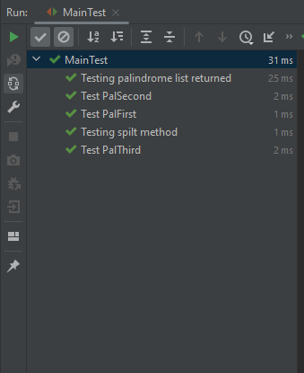

# Palindrome checker

This program takes a sentence from the user via the Scanner class and
returns to the user a list of the palindromes found in their input.
The user is given the option to choose the method used to check for the palindromes.

### The methods are

- For loop method (PalFirst class)
```java
public class PalFirst implements PalInterface {

    // For loop method
    @Override
    public boolean isPalindrome(String str) {

        String noSpaces = str.replaceAll("\\s+", "").toLowerCase();
        int length = noSpaces.length();
        int front;
        int back = length - 1; // reverse index method

        for (front = 0; front < length; front++){
            if (noSpaces.charAt(front) != noSpaces.charAt(back--)){
                return false;
            }
        }
        return true;
    }
}
```
- String Builder method (PalSecond class)
```java
public class PalSecond implements PalInterface {

    // String builder method
    @Override
    public boolean isPalindrome(String str) {

        String noSpaces = str.replaceAll("\\s+", "").toLowerCase();

        StringBuilder sb1 = new StringBuilder(noSpaces);
        String reverse = sb1.reverse().toString(); // Automatic reverse method on StringBuilder class and then toString conversion
        if (noSpaces.equals(reverse)){
            return true;
        }else {
            return false;
        }
    }
}
```
- While loop method (PalThird class)
```java
public class PalThird implements PalInterface{

    // While loop method
    @Override
    public boolean isPalindrome(String str) {

        String noSpaces = str.replaceAll("\\s+", "").toLowerCase();
        int length = noSpaces.length();
        int front = 0;
        int back = length - 1; // reverse index method

        while(back > front){
            char frontChar = noSpaces.charAt(front++); // front++/back-- only increments AFTER the indexing (POST-increments)
            char backChar = noSpaces.charAt(back--);   // vice versa for ++front/--back
            if (frontChar != backChar){
                return false;
            }
        }
        return true;
    }
}
```
### How the program works

- The user is asked and enters the text
```java
Scanner scan = new Scanner(System.in);
System.out.println("Enter a sentence:");
String text = scan.nextLine();
```
- The user is asked and enters 1,2 or 3 to choose the option of method
```java
public String getChoice(){

    Scanner scan = new Scanner(System.in);

    System.out.println("Which palindrome checker would you like to use?");
    System.out.println("1. For loop indexing 2. String builder 3. While loop indexing");

    return scan.nextLine();
}
```
- The text is put into lower case and spilt up into words
- These words are stored in an ArrayList
```java
public ArrayList<String> split(String text) {
        ArrayList<String> words = new ArrayList<>(Arrays.asList(text.toLowerCase().split(" ")));
        return words;
}
```
- They are passed one at a time to the chosen palindrome algorithm
- A list is then built from the words that returned 'true' from these checks
```java
    public ArrayList<String> parseCheck(ArrayList<String> words, String choice){

        ArrayList<String> palindromes = new ArrayList<>();

        for (String word : words) {
            switch (choice) {
                case "1" -> {
                    PalFirst checker1 = new PalFirst();
                    if (checker1.isPalindrome(word)) {
                        System.out.println(word + " is a palindrome!");
                        palindromes.add(word);
                    }
                }
                case "2" -> {
                    PalSecond checker2 = new PalSecond();
                    if (checker2.isPalindrome(word)) {
                        System.out.println(word + " is a palindrome!");
                        palindromes.add(word);
                    }
                }
                case "3" -> {
                    PalThird checker3 = new PalThird();
                    if (checker3.isPalindrome(word)) {
                        System.out.println(word + " is a palindrome!");
                        palindromes.add(word);
                    }
                }
            }
        }
        return palindromes;
    }
```
- The palindromes are then returned and displayed
```java
ArrayList<String> palindromes = palCheck.parseCheck(palCheck.split(text), palCheck.getChoice());
System.out.println("your palindromes: " + palindromes);
```
### Testing

#### SetUp
```java
private final String testString = "Hello Yes Fine Racecar";
private final PalindromeCheckInit testPalCheck = new PalindromeCheckInit();
private final String[] array = {"hello", "yes", "fine", "racecar"};
private final ArrayList<String> testList = new ArrayList<>(Arrays.asList(array));```
```
Test 1 - To test the split method correctly splits text given to it into a lower
case ArrayList.
```java
@Test
@DisplayName("Testing spilt method")
    void testPalSplit(){
            Assertions.assertEquals(testList, testPalCheck.split(testString));
            }
```
Test 2 - To test that the parseCheck method correctly used each palindrome
method to construct and return an ArrayList containing the palindromes from
the text entered with Choice = "1"
```java
@Test
    @DisplayName("Testing palindrome list returned 1")
    void testPalParseChoice1(){

        String[] expectedArray = {"racecar"};
        ArrayList<String> expected = new ArrayList<>(Arrays.asList(expectedArray));

        Assertions.assertEquals(
                expected,
                testPalCheck.parseCheck(testPalCheck.split(testString), "1")
        );
    }
```
Test 3 - To test that the parseCheck method correctly used each palindrome
method to construct and return an ArrayList containing the palindromes from
the text entered with Choice = "2"
```java
@Test
    @DisplayName("Testing palindrome list returned with choice 2")
    void testPalParseChoice2(){

        String[] expectedArray = {"racecar"};
        ArrayList<String> expected = new ArrayList<>(Arrays.asList(expectedArray));
        Assertions.assertEquals(
                expected,
                testPalCheck.parseCheck(testPalCheck.split(testString), "2")
        );
    }
```

Test 4 - To test that the parseCheck method correctly used each palindrome
method to construct and return an ArrayList containing the palindromes from
the text entered with Choice = "3"
```java
@Test
    @DisplayName("Testing palindrome list returned with choice 3")
    void testPalParseChoice3(){

        String[] expectedArray = {"racecar"};
        ArrayList<String> expected = new ArrayList<>(Arrays.asList(expectedArray));
        Assertions.assertEquals(
                expected,
                testPalCheck.parseCheck(testPalCheck.split(testString), "3")
        );
    }
```

Test 5 - To test the PalFirst class correctly identifies palindromes and non
palindromes.
```java
@Test
    @DisplayName("Test PalFirst")
    void testPalFirst(){
        PalFirst checker = new PalFirst();
        Assertions.assertTrue(checker.isPalindrome("racecar"));
        Assertions.assertFalse(checker.isPalindrome("hello"));
    }
```
Test 6 - To test the PalSecond class correctly identifies
palindromes and non palindromes.
```java
@Test
    @DisplayName("Test PalSecond")
    void testPalSecond(){
        PalSecond checker = new PalSecond();
        Assertions.assertTrue(checker.isPalindrome("racecar"));
        Assertions.assertFalse(checker.isPalindrome("hello"));
    }
```
Test 7 - To Test the PalThird class correctly identifies palindromes and non 
palindromes.
```java
@Test
    @DisplayName("Test PalThird")
    void testPalThird(){
        PalThird checker = new PalThird();
        Assertions.assertTrue(checker.isPalindrome("racecar"));
        Assertions.assertFalse(checker.isPalindrome("hello"));
    }
```
Test results

